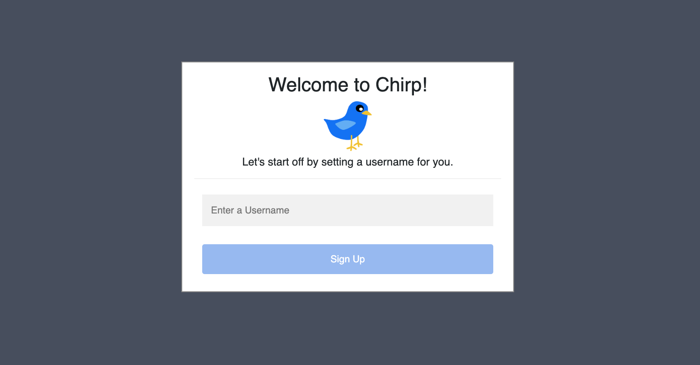
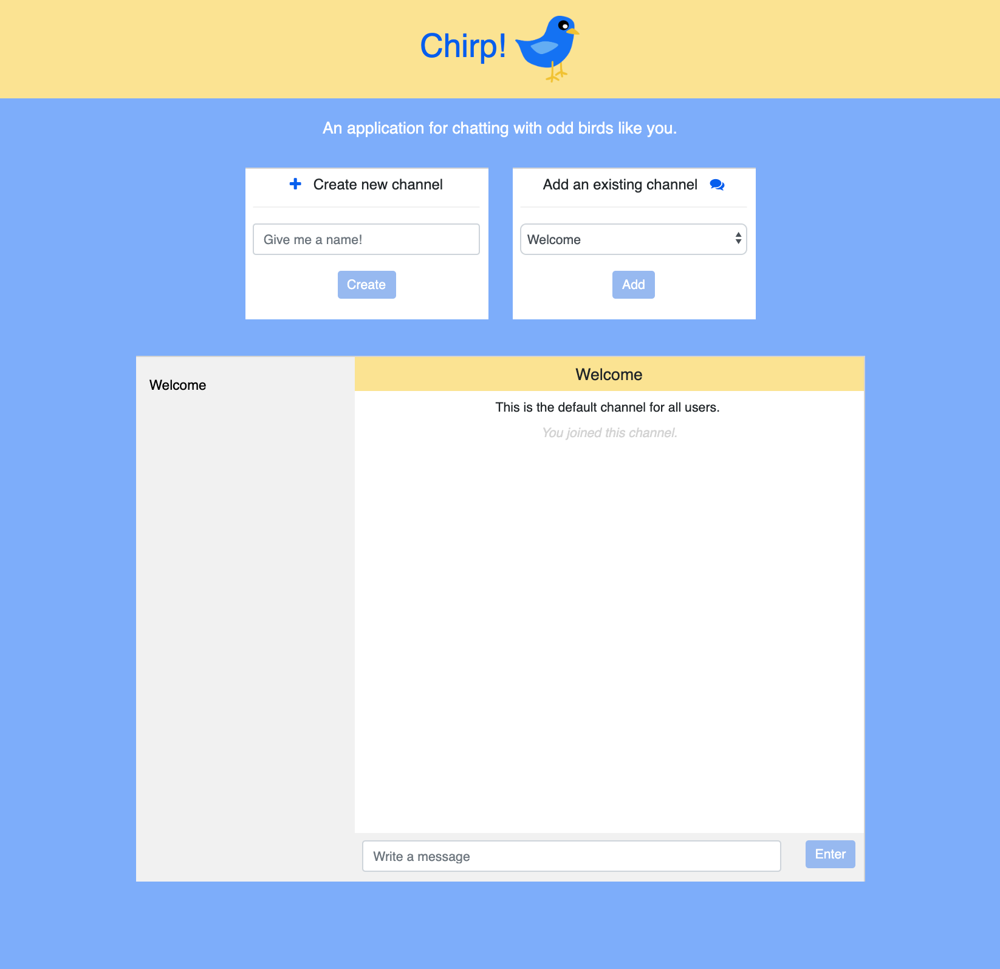
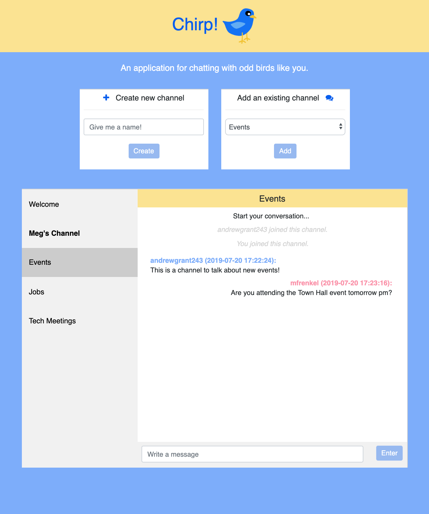

# _Chirp!_ A Chat Application

## I. About

_Chirp!_ is an interactive web application that allows users to create and send messages 
to other users in custom channels that they or other users create. 

## II. User Navigation + Usage

The following outlines a typical user experience with Chirp!, with images captured from the
website pages for two test users, `mfrenkel` and `andrewgrant243`.

Upon loading the application, users are directed to create a username within 
a pop-up window. If the provided username already exists, the user will be notified in
 the pop-up and prompted to try another username.

<p align="center">
  
</p>

Once the username is approved, the _Chirp!_ interactive application will open. 
The application, without any channels created or messages sent, will load only with
a `Welcome` channel that all users share and are added to by default. 

<p align="center">
  
</p>

Within the app, a user then has three potential actions: 
1. Submit a message to the 'Welcome' channel, by writing text in the `Write a message` field and 
selecting `Enter`
2. Create a new channel in the left top panel, with any name.
3. Add an existing channel (note there must be channel available on the server already).

Any newly created or added channels will line up on the left of the main chat box in grey. 
Users can simply click on any given channel name, functioning like a tab, to open up that channel.

Once a user is active in channels, they can expect two types of notifications:
1. When a new user is added to a channel, they will notified with a small grey message in the
center of the chat application. 
2. When a new message is loaded into a channel _that isn't already open_, the left Channel tab 
will become bold. Once the user clicks on this channel to read the message, the flag will clear.

See examples of both notifications in the screenshot below, with `Meg's Channel` having an unread notification
and two instances of messages when `andrewgrant243` and `mfrenkel` joined the channel (note `mfrenkel` is 
shown as `You` because this window represents `mfrenkel`'s window).


<p align="center">
  
</p>

The message box will scroll, such that conversation lengths are not limited
to the size of the screen. However, the server will only preserve the most recent 100 messages
for each channel.

## III. Components

### HTML + CSS
This application works off of a single HTML page: `index.html`. Note that in order 
to provide users with a dynamic experience, additional HTML is generated as the program
runs using JavaScript (see below).

All formatting for the website is controlled by a single stylesheet, found in
`static/stylesheets/styles.css`.

Images and icons used in this website can similarly be found under `static/img/`.

### JavaScript
This application uses JavaScript (program found in `/static/index.js`) in order to produce a
dynamic user experience.  

In order to enable bidirectional, event-based communication between the client and server,
this project uses Socket.IO, a JavaScript library built for realtime web applications.
Socket.IO is leveraged to communicate (a) newly available channels (b) new messages 
in a channel, (c) new users of channels. enables new channels, messages, 
and users to be broadcast to all users.

Additionally, this project uses XMLHttpRequest objects to make requests to the project's
API endpoints (read more about the Flask server below) in order to (a) add users to channels
(b) get all messages stored in the server for a given channel and (c) get a list of all
available channels on the server.

This application additionally utilizes localStorage such that JavaScript can remember both the
username of the user and which channels that user has added to their application. This allows a
user to return back to _Chirp!_ without loosing their channels or messages.

### Flask

This website is supported by a python microframework called Flask, with 
routes configured in this project's `application.py` file. 

These routes makes the following endpoints available:

* `/`: default, servers the `index.html` file.
* `/api/create_user`: accepts an XMLHttpRequest `POST` request to create a new user/username. This request must
contain the username information.
* `/api/messages`: accepts an XMLHttpRequest `POST` request containing an "uncleaned" channel 
name and returns a result containing the list of messages/announcements available.
* `/api/available_channels`: accepts an XMLHttpRequest `POST` request for new channels
that returns a list of the names of the channels stored on the server. 

Additionally, this server uses Flask-SocketIO in order to register the following
emitted Socket.IO messages from the client-side and re-emit new events back to the client:
* accepts `new channel` event to create a new channel on the server, broadcasting back to all as `announce channel`.
* accepts `add channel user` event to add a user to a Channel, broadcasting back to all as `new channel user`.
* accepts `handle message` event to add a message to a Channel, broadcasting back to all as `new message`.

## IV. Usage Locally

In order to deploy _Chirp!_ locally, please follow the steps below.

#### Set up local python environment
Modules required for this project are outlined in `requirements.txt`. You may create a 
virtual environment with this requirements with the following commands:

(1) Create your virtual environment (venv):
```
$ pip install virtualenv
$ virtualenv venv
``` 

(2) Activate your venv:
```
$ source venv/bin/activate
```
(3) Install your requirements:
```
$ pip install -r requirements.txt
```

#### Set local variables
Running this project locally requires configuring local environmental variables, 
including the following:

* `FLASK_APP=application.py`: points Flask to `application.py` for routes
* `SECRET_KEY={any secret key you want}`: provides a secret key that Flask app requires and can be anything.

You may also want to read Flask app documentation for best development configurations.

#### Run
With the above completed, you can deploy the website locally and review it by running Flask:
```
$ flask run
```
Use the resulting url printed by Flask in any browser. 

**Note**: This application utilizes localStorage to keep track of the user's identity (username)
and the channels associated with their username. However, the Flask server keeps track of channels
within memory as a global variable that is reset when a developer quits Flask. This means that for best
performance of the app, run `localStorage.clear()` in the development console of your browser before re-launching
the Flask app.

## V. Developer Notes 
This project was developed on a Macbook (macOS Mojave) and was primarily tested in
Safari and Chrome.

### Future Releases
Future releases of _Chirp!_ will allow users to (1) remove themselves from channels, (2) have private
channels with other users and (3) mark messages as 'unread' to return to later.

